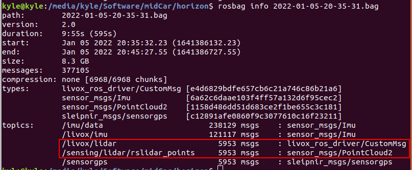
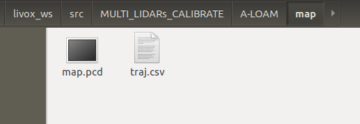
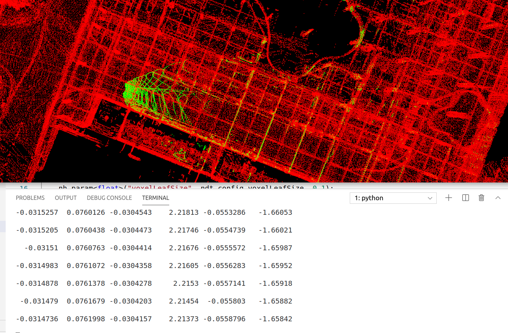
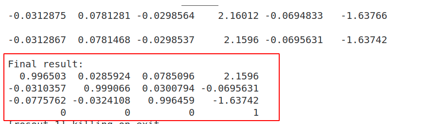

# MULTI_LIDARs_CALIBRATE

## INTRODUCTION

This is an extrinsic calibration system for multiple Livox LiDAR. Since the FOV of Livox devices is generally narrow, we often use multiple Livox devices for combined navigation. Therefore, direct external parameter calibration of LiDAR is necessary. However, if there is no common FOV between Livox devices, the calibration of external parameters is difficult to achieve. In this system, we propose to overcome the above challenges by means of a rotating LiDAR （such as Velodyne VLP-16, Robosense-16...）. The specific method is to first use the rotating LiDAR to construct a map and record the trajectory, and then register all Livox point clouds with the map to calculate the transformation between LiDAR and LiDAR.

## DEPEND

Ubuntu 18.04

ROS

[livox_ros_driver](https://github.com/Livox-SDK/livox)

[ndt_omp](https://github.com/koide3/ndt_omp)

[Ceres Solver](http://www.ceres-solver.org/)

## BUILD

```shell
cd catkin_ws/src
git clone https://github.com/koide3/ndt_omp.git
git clone https://github.com/GDUT-Kyle/MULTI_LIDARs_CALIBRATE.git
cd ..
catkin build ( or catkin_make)
```

## RUN

### 1. Prepare your `rosbag`

Since the system needs to be based on the map generated by A-LOAM, a rotating LiDAR (velodyne VLP-16, Robosense-16) must be used.  In addition, the rosbag needs to contain the Livox message (`livox_ros_driver::CustomMsg`) that needs to be calibrated. Before recording a rosbag, all Livox devices must refer to [livox device time synchronization manual](https://github.com/Livox-SDK/Livox-SDK/wiki/livox-device-time-synchronization-manual) to configure time synchronization.



### 2. Generate a map based on [A-LOAM](https://github.com/HKUST-Aerial-Robotics/A-LOAM)

The A-LOAM included in this project has been **modified**. It can save the constructed map and motion track. 

```shell
roslaunch aloam_velodyne_mapping aloam_velodyne_VLP_16.launch
rosbag play [YOUR-ROSBAG]
```



### 3. Start calibration

Configure the initial estimation of the external parameters and the parameters of the NDT in the yaml file. 

```yaml
calibration:
  # Extrinsics (RSLIDAR -> LIVOX)
  extrinsicTrans: [0.0, 0.0, 0.0]
  extrinsicRot: [1, 0, 0,
                  0, 1, 0,
                  0, 0, 1]
  # NDT parameter
  voxelLeafSize: 0.1
  resolution: 0.5
  numThreads: 8
```

Specify the path of the map, track and rosbag in the launch file.

```xml
<param name="map_path" type="string" value="$(findaloam_velodyne_mapping)/map/map.pcd" />
<param name="traj_path" type="string" value="$(find aloam_velodyne_mapping)/map/traj.csv" />
<param name="bag_path" type="string" value="/media/kyle/Software/midCar/horizon/2022-01-05-20-35-31.bag" />
```

Finally, launch calibration.

```shell
roslaunch multi_lidar_calibration calibration.launch
```


## RESULT





It must be noted that this project can be easily extended to external parameter calibration between multiple Livox devices (even if they do not have a common FOV). But the shortcoming of this project is also obvious, it must rely on a rotating LiDAR as a reference (of course, the rotating LiDAR can be disassembled after the calibration is completed).

## THANKS

[A-LOAM](https://github.com/HKUST-Aerial-Robotics/A-LOAM)

[ndt_omp](https://github.com/koide3/ndt_omp)
